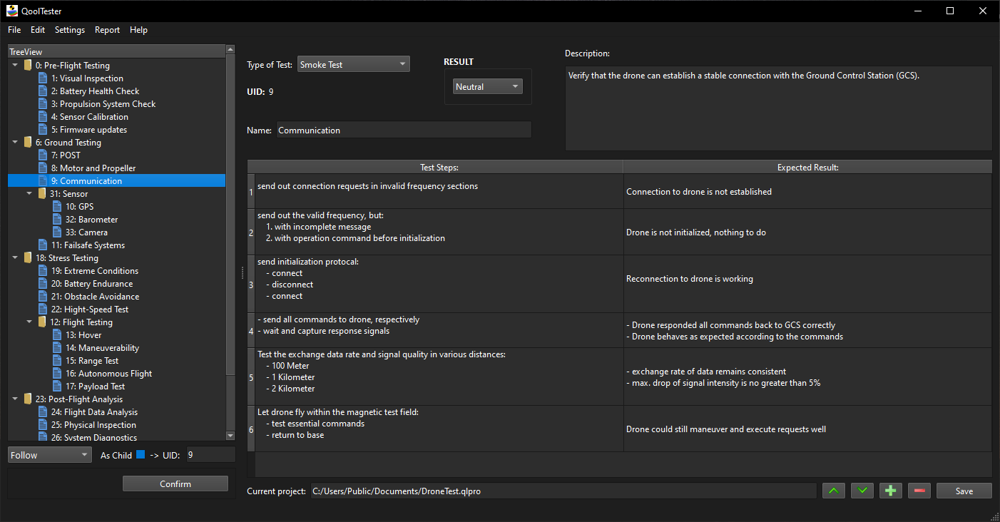
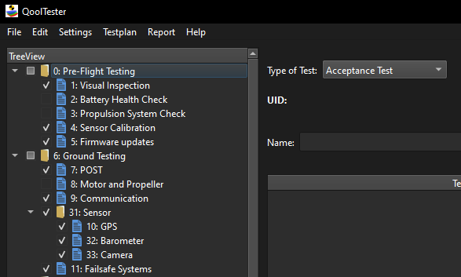
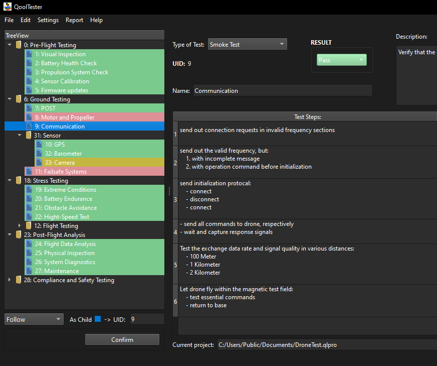
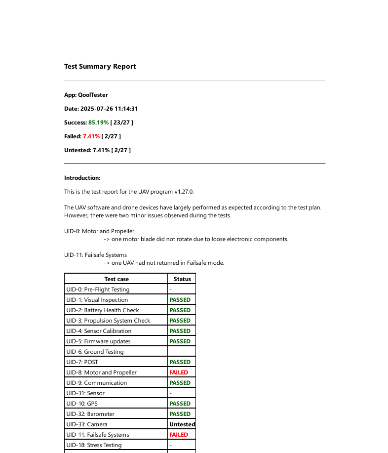

# QoolTester
A lightweight management tool for manual testing.

Welcome to the manual page. QoolTester is a lightweight management tool for manual testing, which allows user to create, modify and save test cases as project file.

To start a test run, simply mark down the pass fail result for each test. By the end of the testing cycle, a test report can be generated with aditional summary info.

## Editing Tests
Select one test case, then use the utilities at the buttom right corner. Test steps can be added, deleted or moved around. `Save` button or the shortcut `Ctrl+S` stores changes to the project.

## Managing Tests
- `Follow`: click on an existing test case or folder under tree view and input the UID to follow; choose `as Child` if a deeper layer is desired. Beyond `Confirm` the highlighted test case is moved behind the UID.
- `Add Subfolder`: enter an existing UID, `Confirm`, then a new test folder with a new UID is appended behind the target UID.
- `Add Testcase`: same as `Add Subfolder`, but as test case.
- `Delete`: the selected test case or folder including its subdirectories is going to be removed.

## Export Testplan
- click "Export Start"
- check the checkboxes in front of the testcases, including the testfolders
- click "Export Finish"

## Utilities
- All testing results can be cleaned up via `Edit`|`Clear Results`.
- Enabling `Settings`|`Auto Expand` will expand the tree structure to display all test items.

## Tips
Under tree view navigate using arrow keys, press `Space` to display its content.

## Screenshots

